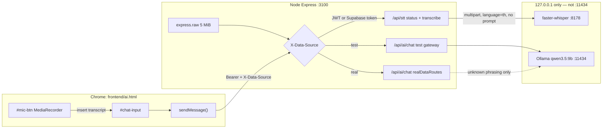
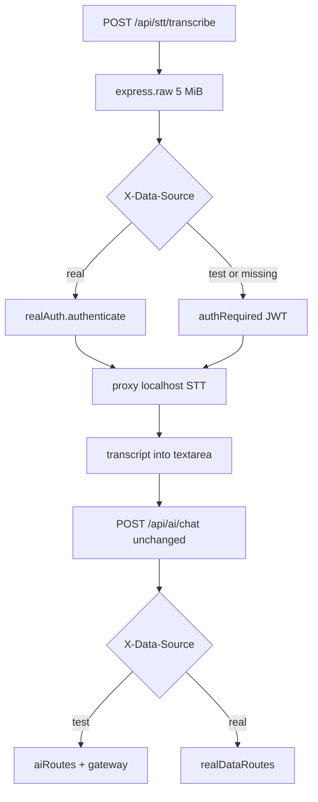

# Local Voice Input (Speech-to-Text) for ThaniPitak AI Chat

| Field | Value |
|---|---|
| **Document** | Local STT v1 — push-to-talk speech-to-text for `/ai.html` |
| **Author** | TBD |
| **Date** | 2026-09-17 |
| **Status** | Draft (revised after review) |
| **Product** | ThaniPitak AI sandbox (`E:\Projects\Thanipitak-sandbox`) |
| **Branch** | `phase-3.3-low-latency` (do not merge to `main` implicitly) |
| **Audience** | Senior engineers working from `docs/agent-handoff.md` and `Agents.md` |

---

## Overview

Officers already talk to ThaniPitak in Thai spoken phrasing, but they must type. This design adds **push-to-talk voice input** that turns speech into text locally, then reuses the existing chat pipeline unchanged.

The browser records a short clip with `MediaRecorder`, `POST`s the audio to **this app's authenticated backend**, and the backend proxies the bytes to a **localhost STT process** (default: faster-whisper HTTP server on `127.0.0.1:8178`). The transcript is inserted into `#chat-input` for the officer to review and edit. Sending still goes through `sendMessage()` → `ChatContext.buildChatBody()` → `POST /api/ai/chat`. STT never interprets intent, never talks to Ollama, never reads the registry, and never sends audio to a cloud service.

v1 is a microphone next to ส่ง, a local STT health check with Thai errors, and no auto-send. Typing continues to work if STT is down.

---

## Background & Motivation

### Current state

The chat UI (`frontend/ai.html`, `frontend/ai.js`) is vanilla JS with no bundler. The footer is:

```html
<div class="input-row">
  <textarea id="chat-input" ... maxlength="2000"></textarea>
  <button id="send-btn" class="send-btn">ส่ง</button>
</div>
```

`sendMessage()` already understands Thai spoken questions once they are text. Test mode goes `src/routes/aiRoutes.js` → `src/ai/gateway.js` (fast paths, tools, Ollama `qwen3.5:9b` at `127.0.0.1:11434`). Real mode is intercepted first in `src/app.js` by `X-Data-Source: real` → `src/routes/realDataRoutes.js` (Supabase user token + station scope). Auth tokens live in `localStorage` as `tp_token` / `tp_data_source`. The body must never contain `station_id`, `role`, or `sql` (`FORBIDDEN_BODY_FIELDS` in `aiRoutes.js` and `ChatContext`).

Local inference is already a first-class constraint: Ollama is loopback-only (`OLLAMA_HOST`). Voice must follow the same pattern. Cloud STT (Google, Azure, Whisper API, browser `webkitSpeechRecognition` which often hits Google) is unacceptable because utterances can contain **real person names**.

### Pain points

- Officers in noisy offices / radios cannot type Thai quickly on PC or phone.
- The product promise is “พิมพ์ภาษาพูดได้เลย”; voice is the missing first mile, not a new intent engine.
- `X-Data-Source: real` currently swallows unknown `/api/*` routes with `409 REAL_FEATURE_UNAVAILABLE` (`realDataRoutes.js` catch-all). A naïve `/api/ai/stt` would break real-mode voice even though STT is not a registry feature.
- Real `/api/ai/status` currently hardcodes `available: true` and does not prove Ollama is up. STT health must not copy that lie.

### Why now

Chat already has spoken-Thai coverage. Adding STT as a **text source** is the smallest change that makes the assistant usable hands-busy, without expanding real-data capabilities that the handoff still marks incomplete (PDF, some history paths).

---

## Goals & Non-Goals

### Goals (v1)

1. Microphone button in the chat footer next to `#send-btn`.
2. Push-to-talk recording in the browser (`MediaRecorder`).
3. Authenticated app proxy to a **local** STT HTTP process. The browser must not call the STT port directly.
4. Insert transcript into `#chat-input`; officer sees/edits before send.
5. If local STT is down: Thai error; typing and ส่ง still work.
6. Thai language (`language=th`).
7. Test vs real data source **unchanged**. Voice is source-agnostic infrastructure.
8. No persistence of audio. No transcript logging of real (or, by default, any) queries. Temp files used for ffmpeg/decode are unlinked in `finally` and never live under the repo.
9. Works on desktop Chrome at `http://127.0.0.1:3100`. Best-effort mobile Chrome on a secure context.

### Non-goals (v1)

- Text-to-speech / spoken replies (future only).
- Always-on listening or wake-word (“เฮ้ ธานี”).
- Auto-send after transcription (optional later flag; default off).
- Whisper `prompt` / `initial_prompt` domain vocabulary (echo risk into routing tokens).
- Re-implementing intent, tools, or registry reads in the STT layer.
- Cloud STT, browser cloud speech APIs, in-browser WASM Whisper, or sending audio to Ollama.
- Safari / Firefox as a supported matrix (Chrome first).
- Packaging STT inside the Node process, GPU orchestration, or a public HTTPS pilot.
- Changing Ollama model, real-data feature gates, or `ChatContext.buildChatBody()`.
- Word-error-rate targets or claiming `medium` is the best Thai model.

---

## Key Decisions

| Decision | Choice | Rationale |
|---|---|---|
| STT vs LLM | Separate local STT process; Ollama stays chat-only | `qwen3.5:9b` is not an ASR model. Conflating them would add latency and send audio (or bad transcripts) into the untrusted-model path. |
| Network path | Browser → Express (`/api/stt`) → `127.0.0.1:8178` | STT has no auth. Direct browser→8178 would skip JWT/Supabase checks and leak a raw transcription port. WASM-in-browser is Alternative H (rejected for v1). |
| Mount point | `/api/stt/*` in `src/app.js` **after** `createRealAuthRoutes(options.realAuth)` and **before** `app.use('/api', real interceptor)` | Real router catch-all returns `409 REAL_FEATURE_UNAVAILABLE`. STT is not a registry feature; it must work in both test and real sessions. |
| Auth | Same token as chat: local JWT **or** Supabase user token, selected by `X-Data-Source` | Reuse `authRequired` and `realAuth.authenticate`. Never accept role/station from the body. |
| Body vs auth order | `express.raw` (5 MiB) **then** `authenticateBySource` on `POST /transcribe` only | A 401 before draining a 5 MiB body leaves the socket unread. Wasting ≤5 MiB RAM on a bad token is cheaper than hung connections. `GET /status` authenticates with no body parser. |
| Engine (default) | **faster-whisper** (CTranslate2) via in-repo `scripts/stt-server.py`, OpenAI-compatible `POST /v1/audio/transcriptions` | Usable local Thai ASR on a Windows CPU (`medium` int8) or NVIDIA GPU (`large-v3`). Not a WER claim. whisper.cpp is a documented alternate (`STT_API=whispercpp`). |
| Bind address | STT **must** listen on `127.0.0.1` only | Matches Ollama policy (`OLLAMA_HOST=http://127.0.0.1:11434`). Node on the same machine is the only client. |
| Loopback guard | `new URL(STT_URL)`: protocol `http:` only; hostname `127.0.0.1` / `localhost` / `::1`; **refuse port `11434`**. On failure: **disable + warn, never throw** | Cloud-exfil catch for `STT_URL=https://api.openai.com`. `localhost` may be `::1`. Copy-paste `OLLAMA_HOST` must not POST audio into the LLM. Typing still works. |
| `STT_ENABLED=false` | Still mount `/api/stt`. Status `{available:false}`; transcribe `503 STT_UNAVAILABLE` | Stable path for UI and tests. Do not omit the router. Same as Ollama-down: app starts, typing works. |
| Health probe | `GET /health` → `GET /v1/models` → `GET /` → TCP connect to host:port. Never POST `/inference` for health | Helper implements `/health`. whisper.cpp may only listen; TCP means “process up,” not “model loaded.” |
| Insert vs auto-send | Insert into `#chat-input`; user sends | Names and place names will be misheard. Editing before `sendMessage()` is the privacy and accuracy control. |
| Whisper `prompt` | **None in v1.** Do not send `prompt` / `initial_prompt` | A constant string with `เสี่ยงสูง` / `เฝ้าระวัง` can be echoed into the textarea and change real-mode routing. Edit-before-send is not enough if the officer does not notice. |
| Audio lifetime | Node: in-memory `Buffer` only. Helper: Windows-safe temp + `os.unlink` in `finally`. Never repo `tmp/`, `data/`, `output/` | Real-person names may be in the clip. `NamedTemporaryFile(delete=True)` is banned on Windows (file stays locked; unlink often fails). |
| Transcript / audit | **No `ai_audit_logs` rows for STT** (test or real). Stdout metadata only, never transcript | Real `req.user.id` is a Supabase `user_id`; writing it into fixture SQLite mixes sources (handoff item 10). Do not “fix” audit by logging spoken PII. |
| Duration cap | Client auto-stop at 45s (UX). Helper measures WAV samples after ffmpeg and may return `AUDIO_TOO_LONG`. **Do not trust `X-Audio-Duration-Ms`.** Hard server caps = 5 MiB + `STT_TIMEOUT_MS` | The header is spoofable. Opus at ~16 kbps can hold minutes under 5 MiB. |
| Concurrency | **Fail-fast 429 `STT_BUSY`** when another transcribe is in-flight. **No queue.** Rate limit 10/min (`STT_RATE_LIMITED`) is PR 4 | Overlapping Whisper+Ollama on one desktop saturates CPU. Queuing exceeds the 35s UI timeout. Two different 429 codes, two Thai strings. |
| Codec | Browser `audio/webm;codecs=opus` (Chrome); helper ffmpeg → 16 kHz mono WAV | Avoids `multer`. CTranslate2 expects WAV. whisper.cpp alternate requires `--convert`. |
| UX mode | **Hold-to-talk**: `pointerdown`/`touchstart` starts recording; `pointerup`/`touchend`/`pointercancel` stops and uploads. Client **45s auto-stop** if they never release. Do not treat `click` as toggle. | Product decision for v1 (radio-style PTT). Always-on is a non-goal. Toggle is a later option if mobile pointer-capture misfires. |
| Mic vs send | Disable `#send-btn` and ignore Enter while `state.mic` is `recording` or `uploading`. When STT is down, send stays enabled | Prevents sending leftover text while a clip is in flight, then applying a late transcript into an empty box. Goal 5 still holds when STT is unavailable. |
| Chat pipeline | Unchanged after transcript exists | STT is a keyboard substitute. Intent stays in `gateway.js` / `realDataRoutes.js`. |
| v1 success | Transcript appears in `#chat-input`; `/api/ai/chat` path unchanged; no audio files remain after the request | Not a WER number. Officer still edits names. |

---

## Proposed Design

### Architecture



Ollama never receives audio. The STT process never receives JWT, station IDs, or registry rows.

### Request sequence (transcribe)

```mermaid
sequenceDiagram
  actor Officer
  participant UI as ai.js
  participant API as Express /api/stt
  participant STT as faster-whisper :8178
  participant Chat as /api/ai/chat

  Officer->>UI: hold #mic-btn (pointerdown / touchstart)
  UI->>UI: getUserMedia + MediaRecorder; disable ส่ง
  Officer->>UI: release (pointerup / touchend / pointercancel) or 45s auto-stop
  UI->>API: POST /api/stt/transcribe (audio/webm, Bearer, X-Data-Source)
  API->>API: express.raw 5 MiB then authenticateBySource
  alt in-flight already
    API-->>UI: 429 STT_BUSY
  else ok
    API->>STT: POST /v1/audio/transcriptions (file, language=th)
    STT->>STT: ffmpeg 16 kHz mono WAV; unlink temps in finally
    alt WAV longer than 45s
      STT-->>API: 400 AUDIO_TOO_LONG
      API-->>UI: 400 AUDIO_TOO_LONG
    else
      STT-->>API: { text }
      API-->>UI: { transcript, language }
    end
  end
  Note over API: discard Buffer; no ai_audit_logs; do not log text
  UI->>UI: #chat-input.value = transcript; focus; re-enable ส่ง
  Officer->>UI: edit if needed, tap ส่ง
  UI->>Chat: existing sendMessage() body
```

### Component map

| Layer | New / changed | Role |
|---|---|---|
| `frontend/ai.html` | `#mic-btn` beside `#send-btn`; `#mic-status` under the pill | Markup, `aria-pressed`, Thai label |
| `frontend/voiceInput.js` | **new** (UMD like `chatContext.js`) | `applyTranscript`, Thai error map, 45s clamp — unit-tested |
| `frontend/ai.js` | recorder state machine; `loadSttStatus` next to every `loadAiStatus` | PTT, dedicated `fetch`, abort on logout/reset |
| `frontend/ai.css` + `ai-refresh.css` | `.mic-btn`, `.mic-status` | Height 46px; recording pulse; status under pill |
| `src/config.js` | `stt.*` | URL, timeouts, caps from env |
| `src/stt/client.js` | **new** | Loopback guard, health fallback, OpenAI-compatible proxy, 1-in-flight |
| `src/routes/sttRoutes.js` | **new** | `GET /status`, `POST /transcribe` |
| `src/app.js` | mount `/api/stt` **before** real interceptor; raw-then-auth on POST | Source-aware auth |
| `scripts/stt-server.py` | **new** | Local faster-whisper HTTP on 8178 |
| `requirements-stt.txt` | **new** | Pinned helper deps |
| `.gitignore` | `.venv-stt/`, `__pycache__/`, `*.pt`, `*.bin` | Do not commit models or venv |
| `.env.example` | `STT_*` | Documented, no secrets |
| `tests/stt.test.js` | **new** | Auth, size, drain-on-401, real-mode **200**, loopback refuse |
| `tests/sttUi.test.js` | **new** | `applyTranscript` + Thai error map |
| `tests/fixtures/stt-silence.webm` | **new** | Tiny synthetic clip for opt-in `STT_LIVE=1` |

No `logStt` / `ai_audit_logs` changes in v1.

### Frontend behavior

Keep the existing `api()` helper for JSON. **Do not** send audio through it: it sets `Content-Type: application/json` whenever `opts.body` is set (`frontend/ai.js` lines 59–63). Use a dedicated `transcribeAudio(blob)` that:

- Sets `Authorization: Bearer ${state.token}` and `X-Data-Source: ${state.dataSource}` (same as chat).
- Sets `Content-Type` to the recorder MIME (typically `audio/webm;codecs=opus`).
- Sends the `Blob` as the raw body (no JSON, no `station_id`).
- May send `X-Audio-Duration-Ms` for logs/UI only; the server **must ignore it for enforcement**.
- Times out at 35s (STT budget 30s + slack), independent of `CLIENT_TIMEOUT_MS` (180s) used for chat.

Extract pure helpers into `frontend/voiceInput.js` (UMD, same pattern as `frontend/chatContext.js`) so Node tests can require them without jsdom:

```javascript
function applyTranscript(currentValue, text) {
  const t = String(text || '').trim().slice(0, 2000);
  if (!t) return String(currentValue || '');
  const cur = String(currentValue || '').trim();
  const next = cur ? cur + ' ' + t : t;
  return next.slice(0, 2000);
}

function micErrorMessage(code, status) {
  const map = {
    INSECURE_CONTEXT: 'เบราว์เซอร์นี้ยังใช้ไมโครโฟนไม่ได้ กรุณาเปิดผ่าน localhost หรือ HTTPS แล้วพิมพ์แทน',
    PERMISSION_DENIED: 'ไม่ได้รับอนุญาตใช้ไมโครโฟน กรุณาอนุญาตในเบราว์เซอร์ หรือพิมพ์คำถามแทน',
    STT_UNAVAILABLE: 'ระบบแปลงเสียงในเครื่องยังไม่พร้อม กรุณาพิมพ์คำถามได้ตามปกติ',
    EMPTY_TRANSCRIPT: 'ไม่ได้ยินคำพูด กรุณากดค้างไมค์แล้วพูดใหม่',
    AUDIO_TOO_LARGE: 'ไฟล์เสียงใหญ่เกินกำหนด กรุณาพูดใหม่ให้สั้นลง',
    AUDIO_TOO_LONG: 'เสียงยาวเกิน 45 วินาที กรุณาพูดใหม่ให้สั้นลง',
    STT_BAD_AUDIO: 'แปลงไฟล์เสียงไม่ได้ กรุณาพูดใหม่ หรือติดตั้ง ffmpeg',
    STT_BUSY: 'ระบบกำลังแปลงเสียงคำขออื่นอยู่ กรุณารอแล้วพูดใหม่',
    STT_RATE_LIMITED: 'ขอแปลงเสียงถี่เกินไป กรุณารอสักครู่แล้วพูดใหม่',
    STT_TIMEOUT: 'แปลงเสียงใช้เวลานานเกินไป กรุณาพูดใหม่ให้สั้นลง หรือพิมพ์แทน',
  };
  if (status === 401) return 'กรุณาเข้าสู่ระบบใหม่';
  return map[code] || 'เกิดข้อผิดพลาด กรุณาลองใหม่';
}
```

`frontend/ai.html` loads `voiceInput.js` before `ai.js`.

**Hold-to-talk state machine** (`state.mic`: `idle | recording | uploading | unavailable`):

Pointer Events are primary. Also listen for `touchstart`/`touchend` so older WebViews still stop on finger-up; if both fire, ignore the duplicate (do not start two recorders). `setPointerCapture` on `pointerdown` so release off-button still gets `pointerup`. Prevent `contextmenu` on the mic (mobile long-press). **Do not** bind `click` as start/stop.

1. **idle** — `#mic-btn` enabled if `state.sttAvailable !== false` and `!state.sending`. `#send-btn` follows existing `setBusy`.
2. **recording** — on `pointerdown` / `touchstart`: `getUserMedia({ audio: true })`, `MediaRecorder` with `audio/webm;codecs=opus` if supported, else browser default. Button `aria-pressed="true"`, red pulse while held. **Disable `#send-btn` and ignore Enter** (`sendMessage` returns immediately if `state.mic` is `recording` or `uploading`). Auto-stop at **45 seconds** if they never release (then go to uploading).
3. **uploading** — on `pointerup` / `touchend` / `pointercancel`, or after the 45s cap: stop tracks immediately (`stream.getTracks().forEach(t => t.stop())`), `POST /api/stt/transcribe`, `#mic-btn` disabled, `#send-btn` still disabled, `#mic-status` = “กำลังแปลงเสียงเป็นข้อความ…”.
4. **done** — `el.value = VoiceInput.applyTranscript(el.value, transcript)`. `autoResizeInput()`; focus; **do not** call `sendMessage()`; re-enable send.
5. **error** — write Thai text to `#mic-status` (`role="status"`). Do **not** `appendMessage` (a STT failure is not a chat answer). Re-enable send. Chat send remains enabled when STT is merely **unavailable**.

**Permission / capability errors (Thai)** — via `micErrorMessage`:

| Condition | `code` | Message |
|---|---|---|
| No `navigator.mediaDevices` / insecure context | `INSECURE_CONTEXT` | เบราว์เซอร์นี้ยังใช้ไมโครโฟนไม่ได้ กรุณาเปิดผ่าน localhost หรือ HTTPS แล้วพิมพ์แทน |
| Permission denied | `PERMISSION_DENIED` | ไม่ได้รับอนุญาตใช้ไมโครโฟน กรุณาอนุญาตในเบราว์เซอร์ หรือพิมพ์คำถามแทน |
| STT status down / 503 `STT_UNAVAILABLE` | `STT_UNAVAILABLE` | ระบบแปลงเสียงในเครื่องยังไม่พร้อม กรุณาพิมพ์คำถามได้ตามปกติ |
| Empty / too-short audio | `EMPTY_TRANSCRIPT` | ไม่ได้ยินคำพูด กรุณากดค้างไมค์แล้วพูดใหม่ |
| 413 `AUDIO_TOO_LARGE` | `AUDIO_TOO_LARGE` | ไฟล์เสียงใหญ่เกินกำหนด กรุณาพูดใหม่ให้สั้นลง |
| 400 `AUDIO_TOO_LONG` or client 45s notice | `AUDIO_TOO_LONG` | เสียงยาวเกิน 45 วินาที กรุณาพูดใหม่ให้สั้นลง |
| 400 `STT_BAD_AUDIO` | `STT_BAD_AUDIO` | แปลงไฟล์เสียงไม่ได้ กรุณาพูดใหม่ หรือติดตั้ง ffmpeg |
| 429 `STT_BUSY` | `STT_BUSY` | ระบบกำลังแปลงเสียงคำขออื่นอยู่ กรุณารอแล้วพูดใหม่ |
| 429 `STT_RATE_LIMITED` | `STT_RATE_LIMITED` | ขอแปลงเสียงถี่เกินไป กรุณารอสักครู่แล้วพูดใหม่ |
| 401 | (status) | existing `messageForError` → กรุณาเข้าสู่ระบบใหม่ |

Do not disable `#chat-input` when STT is down. Only disable `#mic-btn` (and set `title` / `aria-describedby` to the Thai reason). `#send-btn` is disabled **only** during `recording` / `uploading` or existing `state.sending` — not because STT is down.

**Abort recorder** on all of: logout, source switch, and `resetConversation` (ล้างการสนทนา). Abort in-flight `fetch` (`AbortController`), stop tracks, reset `state.mic` to `idle` or `unavailable`. Source switch already forces logout in `ai.js`; voice must not leak a clip across sessions.

**`loadSttStatus()`** is called everywhere `loadAiStatus()` is called today (`frontend/ai.js` login success ~859 **and** token restore ~892–899). Restoring `tp_token` must not leave the mic stuck `unavailable`.

**Empty-state copy (small):** change “พิมพ์ภาษาพูดได้เลย หรือเลือกตัวอย่างด้านล่างเพื่อเริ่มต้น” to “พิมพ์ภาษาพูดได้เลย กดค้างไมค์เพื่อพูด หรือเลือกตัวอย่างด้านล่าง”. Suggestions still call `sendMessage(q)` as today.

**CSS** (`frontend/ai.css` plus overrides in `ai-refresh.css`; `#mic-status` is a **sibling under** `.chat-input-area`, not inside the `.input-row` pill):

```css
.mic-btn {
  min-height: 46px;
  min-width: 46px;
  padding: 10px 14px;
  border: 0;
  border-radius: 12px;
  background: #f5f4f1;
  color: #555;
  cursor: pointer;
  font-weight: 600;
}
.mic-btn[aria-pressed="true"] {
  background: var(--danger);
  color: #fff;
  animation: mic-pulse 1s ease-in-out infinite;
}
.mic-btn:disabled { opacity: 0.5; cursor: not-allowed; }
@keyframes mic-pulse {
  50% { box-shadow: 0 0 0 4px #dc262633; }
}
.mic-status {
  margin: 6px 4px 0;
  min-height: 1.2em;
  font-size: 12px;
  color: #888;
}
.mic-status.is-error { color: var(--danger); }
```

Place `#mic-btn` **left of ส่ง**, inside `.input-row` so the refresh pill still wraps textarea + mic + send. Icon: inline SVG (no new asset pipeline).

### Backend mount and auth

Critical existing order in `src/app.js`:

```javascript
app.use('/api', (req,res,next) => req.get('X-Data-Source') === 'real' ? realData(req,res,next) : next());
// realData catch-all: 409 REAL_FEATURE_UNAVAILABLE
```

If STT is registered under `/api/ai`, **real mode never reaches it**. Exact insertion — after `createRealAuthRoutes(options.realAuth)` and **before** the real interceptor:

```javascript
const { createSttRoutes } = require('./routes/sttRoutes');

function authenticateBySource(req, res, next) {
  if (req.get('X-Data-Source') === 'real') {
    return realAuth.authenticate(req, res, next);
  }
  return authRequired(req, res, next);
}

const stt = createSttRoutes(options);
// Drain body before 401 so a 5 MiB POST cannot stall the socket.
app.post(
  '/api/stt/transcribe',
  express.raw({
    type: (req) => /^audio\/(webm|mp4|mpeg|wav|ogg|x-wav)(;.*)?$/i.test(req.headers['content-type'] || ''),
    limit: config.stt.maxBytes,
  }),
  authenticateBySource,
  stt.transcribe
);
app.use('/api/stt', authenticateBySource, stt.router); // GET /status
// THEN existing:
// app.use('/api', (req,res,next) => req.get('X-Data-Source') === 'real' ? realData(...) : next());
```

`createApp(db, options)` already injects `gateway` and `ollamaCheck` for tests (`tests/aiPhase3.test.js`). Add `sttCheck` and `sttTranscribe` the same way so tests never spawn Python.

When `config.stt.enabled === false` **or** the loopback guard fails: still mount the routes. `GET /status` returns `{ available: false, engine, language }`. `POST /transcribe` returns `503 STT_UNAVAILABLE`. Do not throw at startup.

`GET /api/health` stays unauthenticated and STT-unaware (process liveness only). STT health is authenticated `GET /api/stt/status`, parallel to `GET /api/ai/status`.

### STT client (`src/stt/client.js`)

Mirror `checkOllamaAvailable()` in `src/routes/aiRoutes.js` (HTTP GET, 5s timeout, never throw, never leak URL in JSON).

**Loopback allowlist** (run at first use and when building the client):

```javascript
function isAllowedSttUrl(raw) {
  let u;
  try { u = new URL(raw); } catch { return false; }
  if (u.protocol !== 'http:') return false;
  const host = u.hostname.replace(/^\[|\]$/g, '').toLowerCase();
  if (!['127.0.0.1', 'localhost', '::1'].includes(host)) return false;
  const port = u.port || (u.protocol === 'http:' ? '80' : '');
  if (port === '11434') return false;
  return true;
}
```

If disallowed: log once `[stt] refuse non-loopback` (**do not log the URL** — it may be a cloud endpoint), treat as disabled, `available: false`, transcribe `503` with **no outbound `fetch`**. Tests must cover `STT_URL=https://api.openai.com` and `STT_URL=http://127.0.0.1:11434`.

**Health fallback order:**

1. `GET ${STT_URL}/health` (helper contract).
2. Else `GET ${STT_URL}/v1/models`.
3. Else `GET ${STT_URL}/` (whisper.cpp may serve a page).
4. Else TCP connect to `hostname:port` (5s). Success means “port open,” not “model loaded.”
5. TCP error / timeout → `{ available: false }`.

Never POST `/inference` as a health check (would require audio).

Browser-facing status JSON:

```json
{ "available": true, "engine": "faster-whisper", "language": "th" }
```

Do **not** echo `STT_URL`, port `8178`, model path, or env names (same rule as `tests/aiPhase3.test.js` “must not expose Ollama URL/config”).

**Transcribe:** Node 22 `fetch` + `FormData` + `Blob` to:

`POST {STT_URL}/v1/audio/transcriptions`

fields (v1 — **no `prompt`**):

- `file`: audio bytes, filename `clip.webm` (or `.mp4` if that was the MIME)
- `language`: `th` (forced)
- `response_format`: `json`
- `temperature`: `0`

Timeout: `STT_TIMEOUT_MS` (default 30000). Map helper/network failures **without** attaching STT stderr or transcript to the client:

| Upstream | App response |
|---|---|
| helper `400` + `code=AUDIO_TOO_LONG` | 400 `AUDIO_TOO_LONG` |
| helper `400` + `code=STT_BAD_AUDIO` | 400 `STT_BAD_AUDIO` |
| timeout | 503 `STT_TIMEOUT` |
| connection error / 5xx | 503 `STT_UNAVAILABLE` |

**Adapter for whisper.cpp:** if `STT_API=whispercpp`, POST multipart to `{STT_URL}/inference` with `language=th`, `response-format=json`, `temperature=0`, **no prompt**. Normalize `{ text }` from either API. Operator **must** start whisper.cpp with `--convert` so Chrome WebM is decoded; without `--convert` every UI clip fails (`STT_BAD_AUDIO`).

**In-flight cap (PR 1):** one process-global flag around the outbound proxy. If busy, return **429 `STT_BUSY` immediately** (do not queue, do not wait). Clear the flag in `finally`. Rate limit 10/min is **not** in PR 1.

### Route contract (`src/routes/sttRoutes.js`)

**`GET /api/stt/status`** — auth required (no raw parser).

**`POST /api/stt/transcribe`** — `express.raw` then auth (see mount snippet). Do not add `multer`.

Global `express.json()` ignores `audio/*`, so it will not consume the body.

`X-Audio-Duration-Ms` is **ignored for authorization and duration enforcement**. It may be omitted.

Validation:

| Check | Failure |
|---|---|
| Missing/empty body | 400 `MISSING_AUDIO` — กรุณาส่งไฟล์เสียง |
| Unsupported Content-Type | 415 `UNSUPPORTED_AUDIO` |
| `req.body.length > STT_MAX_BYTES` (also `express.raw` limit) | 413 `AUDIO_TOO_LARGE` — ไฟล์เสียงใหญ่เกินกำหนด |
| In-flight proxy already running | 429 `STT_BUSY` — ระบบกำลังแปลงเสียงคำขออื่นอยู่ กรุณารอแล้วพูดใหม่ |
| Helper reports duration > 45s after decode | 400 `AUDIO_TOO_LONG` — เสียงยาวเกิน 45 วินาที |
| STT down / loopback refuse / disabled | 503 `STT_UNAVAILABLE` — ระบบแปลงเสียงในเครื่องยังไม่พร้อม กรุณาพิมพ์คำถามได้ตามปกติ |
| Empty transcript | 200 with `{ transcript: "", code: "EMPTY_TRANSCRIPT" }` so the UI can say ไม่ได้ยินคำพูด (not a 500) |

There is **no** server 400 based on the client duration header. If the helper cannot measure duration (misconfigured whisper.cpp without a wrapper), the remaining caps are 5 MiB and `STT_TIMEOUT_MS`.

Success:

```json
{ "transcript": "มีผู้ป่วยจิตเวชกี่คน", "language": "th" }
```

Slice transcript to `MAX_MESSAGE_LENGTH` (2000) on the server. Textarea already `maxlength="2000"`.

**Rate limit (PR 4 only):** 10 transcribes / user / rolling minute, keyed by `req.user.id` (test JWT `id` or real `user_id`). 429 `STT_RATE_LIMITED`. Not a production WAF. **Do not** persist this counter. **Do not** write the real `user_id` to SQLite.

### Default local STT process (helper contract)

`scripts/stt-server.py` is original work (there is no stock faster-whisper OpenAI server we depend on). Implement this contract; do not guess extra fields.

**Listen:** `127.0.0.1:${STT_PORT:-8178}` only (`uvicorn --host 127.0.0.1`). Refuse to bind `0.0.0.0`.

**Model / compute:**

- If `STT_MODEL` is set, use it.
- Else if CUDA is visible (`ctranslate2.get_cuda_device_count() > 0` or equivalent), `large-v3` + `float16`.
- Else `medium` + `int8`.
- `vad_filter=True`, `language="th"`. Ignore unknown request `prompt` fields (v1 Node sends none).

**`GET /health` → 200:**

```json
{ "ok": true, "model": "medium" }
```

Do not include filesystem paths.

**`POST /v1/audio/transcriptions`** — `multipart/form-data`:

| Field | Required | Notes |
|---|---|---|
| `file` | yes | Upload part; Chrome WebM/Opus or WAV |
| `language` | no | Default `th`; helper forces `th` even if omitted |
| `response_format` | no | Only `json` in v1 |
| `temperature` | no | Default `0` |
| `prompt` | no | **Ignored** in v1 |

**Decode (Windows-safe temps):** never `NamedTemporaryFile(delete=True)`. Never write under the repo (`tmp/`, `data/`, `output/`, `frontend/`).

```text
fd, in_path = tempfile.mkstemp(prefix="tpstt_", suffix=".webm", dir=os.environ.get("TEMP") or tempfile.gettempdir())
os.close(fd)
write request bytes to in_path
fd2, wav_path = tempfile.mkstemp(prefix="tpstt_", suffix=".wav", dir=same)
os.close(fd2)
ffmpeg -y -hide_banner -loglevel error -i in_path -ac 1 -ar 16000 wav_path
probe duration from WAV header / samples
if duration > 45s → HTTP 400 { "error": "audio too long", "code": "AUDIO_TOO_LONG" }
faster_whisper.transcribe(wav_path, language="th", vad_filter=True)
HTTP 200 { "text": "<transcript>" }
```

`finally` (always, including errors):

```python
for path in (in_path, wav_path):
    try:
        os.unlink(path)
    except OSError:
        logging.warning("[stt] leftover temp %s", os.path.basename(path))  # basename only
```

Do not log the directory (`C:\Users\…\AppData\Local\Temp` contains profile names).

ffmpeg missing or decode fail → `400 { "error": "cannot decode audio", "code": "STT_BAD_AUDIO" }`. Empty ASR text → `200 { "text": "" }`.

**PR 2 checklist:** after a failed transcribe, `%TEMP%` has no leftover `tpstt_*` files. After a crash mid-ffmpeg, operator may delete leftover `tpstt_*` manually; the helper must not accumulate them on the happy path.

**whisper.cpp alternate:** same port, `STT_API=whispercpp`. **Required flags:**

```text
whisper-server.exe -m ggml-medium.bin --host 127.0.0.1 --port 8178 --convert -l th
```

`--convert` is mandatory (ffmpeg) or Chrome WebM always fails. Node POSTs `{STT_URL}/inference` as documented above. Duration enforcement may be absent; 5 MiB + timeout remain.

Do **not** run STT in Docker bound to `0.0.0.0:8178` on a shared network without an extra firewall rule.

**Pins / gitignore (PR 2):**

- `requirements-stt.txt` — pin `faster-whisper`, `fastapi`, `uvicorn`, `python-multipart` to exact versions chosen at implementation (do not `pip install` unpinned in README).
- `.gitignore` add: `.venv-stt/`, `__pycache__/`, `*.pt`, `*.bin` (model weights). Repo already ignores `tmp/`, `temp/`, `*.tmp`.

**Opt-in live check (not CI):** `tests/fixtures/stt-silence.webm` is a committed **synthetic** silent/tone WebM (no voice, no person). `STT_LIVE=1 npm test` may POST it to localhost:8178. Default `npm test` never downloads models and never needs the helper.

**Exact curl the Node proxy will send** (operator / PR 2 manual check):

```powershell
curl.exe -s -D - http://127.0.0.1:8178/health
curl.exe -s -F "file=@tests/fixtures/stt-silence.webm;type=audio/webm" -F "language=th" -F "response_format=json" -F "temperature=0" http://127.0.0.1:8178/v1/audio/transcriptions
```

Node sends the same four form fields (no `prompt`). Expect `/health` → `{ "ok": true, "model": "..." }` and transcriptions → `{ "text": "..." }` (possibly empty for silence).

### Latency, load, size (v1 sandbox)

| Metric | Target |
|---|---|
| Clip length | 2–15 s typical; client auto-stop 45 s; helper rejects WAV > 45 s |
| Upload | ≤ 5 MiB (`express.raw` hard cap) |
| STT latency CPU `medium` int8 | ~1–4 s for 10 s audio on a recent desktop (indicative, not a SLO) |
| STT latency GPU `large-v3` | often < 1 s for 10 s audio (indicative) |
| Proxy overhead | < 50 ms |
| Concurrent transcribes | **1 in-flight** per Node process; extra requests 429 `STT_BUSY` |
| Persistent storage | 0 bytes of audio after `finally` |
| Peak RAM extra | ~5 MiB audio in Node + model already resident in the STT process (~1–3 GiB for `medium`) |

Chat latency is unchanged: voice adds STT time **before** the officer hits ส่ง.

### Interaction with test vs real



Voice does not grant extra registry access. A transcribed “ขอประวัติ” in real mode still hits the same capability gates as typed text.

---

## API / Interface Changes

### New HTTP APIs (this app)

#### `GET /api/stt/status`

**Auth:** Bearer (test JWT or real Supabase token) + `X-Data-Source`.

**200:**

```json
{ "available": true, "engine": "faster-whisper", "language": "th" }
```

When the helper is down, disabled, or URL fails the loopback guard: `{ "available": false, "engine": "faster-whisper", "language": "th" }` still 200 (same pattern as `/api/ai/status` + `ollamaCheck`).

#### `POST /api/stt/transcribe`

**Headers:**

```
Authorization: Bearer <token>
X-Data-Source: test | real
Content-Type: audio/webm;codecs=opus
X-Audio-Duration-Ms: 8320   # optional, advisory only — not enforced
```

**Body:** raw audio bytes (not JSON, not multipart).

**200:** `{ "transcript": "มีผู้เสพกี่คน", "language": "th" }`

**Errors:** Thai `error` string + `code` as in existing routes (`NO_TOKEN`, `STT_UNAVAILABLE`, `STT_BUSY`, `AUDIO_TOO_LARGE`, `AUDIO_TOO_LONG`, …).

### Frontend interface (conceptual)

```javascript
// frontend/ai.js — do not reuse api() for binary
async function transcribeAudio(blob, durationMs, signal) {
  const headers = {
    Authorization: 'Bearer ' + state.token,
    'X-Data-Source': state.dataSource,
    'Content-Type': blob.type || 'audio/webm',
  };
  if (durationMs != null) headers['X-Audio-Duration-Ms'] = String(durationMs);
  const res = await fetch('/api/stt/transcribe', {
    method: 'POST', headers, body: blob, signal,
  });
  // ...
}

function applyTranscriptToInput(text) {
  const el = $('#chat-input');
  el.value = window.VoiceInput.applyTranscript(el.value, text);
  autoResizeInput();
  el.focus();
}
```

`sendMessage()` returns immediately when `state.mic` is `recording` or `uploading` (in addition to existing `state.sending` / empty checks). `#mic-btn` is disabled while `state.sending`.

### Config (`src/config.js` + `.env.example`)

```javascript
stt: {
  enabled: process.env.STT_ENABLED !== 'false',
  url: process.env.STT_URL || 'http://127.0.0.1:8178',
  api: process.env.STT_API || 'openai', // openai | whispercpp
  language: process.env.STT_LANGUAGE || 'th',
  timeoutMs: Number(process.env.STT_TIMEOUT_MS) || 30000,
  maxBytes: Number(process.env.STT_MAX_BYTES) || 5 * 1024 * 1024,
  maxSeconds: Number(process.env.STT_MAX_SECONDS) || 45, // helper WAV cap; not the spoofable header
}
```

`src/config.js` reads dotenv **once at process start**. Changing `STT_URL` requires **restarting Node** (`npm start`). Restarting only `stt-server.py` is enough if the URL is unchanged.

If `stt.enabled` is false **or** `isAllowedSttUrl(stt.url)` is false: log a warning, keep `enabled` effective-false, still export the object. Do not throw.

### HTML delta

```html
<script src="chatContext.js"></script>
<script src="voiceInput.js"></script>
<script src="ai.js"></script>
<!-- footer -->
<div class="input-row">
  <textarea id="chat-input" ...></textarea>
  <button id="mic-btn" class="mic-btn" type="button"
          aria-label="กดค้างเพื่อพูดแล้วแปลงเป็นข้อความ" aria-pressed="false">ไมค์</button>
  <button id="send-btn" class="send-btn">ส่ง</button>
</div>
<p id="mic-status" class="mic-status" role="status"></p>
```

No new JS libraries, no bundler, no `webkitSpeechRecognition`.

---

## Data Model Changes

**None.** No new tables, no audio columns, no transcript store, **no `ai_audit_logs` action for STT in v1**.

Stdout may include `bytes`, `durationMs` (from helper or omitted), `sttMs`, `success`, `empty`, `code`. Never transcript. Never real `user_id` in a line that is copied to the fixture DB.

**Migration:** none. **Rollback:** set `STT_ENABLED=false` and restart Node, or stop the Python process; UI disables mic when status is false. No DB migration to undo.

---

## Alternatives Considered

### A. Browser talks to STT on :8178 directly

**Pros:** one less hop; slightly lower latency.  
**Cons:** STT has no JWT; any page (or LAN client if mis-bound) can dump audio. CORS would have to allow the UI origin on the STT process. Violates “browser must not skip auth”.  
**Rejected** for v1.

### B. Cloud STT (OpenAI Whisper API, Google, Azure) or `webkitSpeechRecognition`

**Pros:** less local ops; often better noise robustness.  
**Cons:** audio with real names leaves the machine. Explicit product constraint. `webkitSpeechRecognition` on Chrome is cloud-backed.  
**Rejected.** Loopback guard exists specifically to prevent this becoming an env-typo accident.

### C. Put routes on `/api/ai/stt` inside `createAIRoutes`

**Pros:** groups “AI” APIs.  
**Cons:** `realDataRoutes.js` catch-all 409s unknown `/api/*` in real mode. Duplicating STT in the real router couples voice to registry work. Real `/api/ai/status` already lies about availability.  
**Rejected.** `/api/stt` is source-agnostic infrastructure, like a future honest health surface.

### D. Embed faster-whisper in the Node process (N-API / child_process per request)

**Pros:** one `npm start`.  
**Cons:** 1–3 GiB model in the API process; Python/C++ build story on Windows; harder to mock; crashes take down chat. Current pattern is already “Node + sibling Ollama”.  
**Rejected.** Sibling HTTP process matches Ollama.

### E. whisper.cpp as the only default

**Pros:** single `.exe`, no Python.  
**Cons:** ffmpeg still needed for WebM (`--convert`); Thai `medium` is typically a step behind faster-whisper at the same size (qualitative, not a measured WER); CUDA build on Windows is painful.  
**Kept as documented alternative** (`STT_API=whispercpp`), not the default.

### F. Auto-send transcript

**Pros:** faster hands-busy UX.  
**Cons:** a misheard name becomes a registry lookup the officer did not intend.  
**Deferred.** Feature flag `STT_AUTO_SEND=false` can be added later; v1 code should make `applyTranscript()` the only completion path.

### G. Always-on wake word

**Pros:** radio-style “เฮ้ ธานี”.  
**Cons:** continuous microphone, higher PII risk, battery, false wakes in a noisy office.  
**Non-goal.**

### H. In-browser Whisper (WASM / transformers.js)

**Pros:** audio never leaves Chrome; no Express proxy; no Python helper; Goal 8 (no persistence) is easier because bytes never hit Node.  
**Cons:** a `medium` multilingual WASM bundle is hundreds of MB downloaded into the officer’s profile; no shared desktop NVIDIA GPU with the helper; Thai quality on CPU WASM is weaker than CTranslate2; `npm test` cannot mock a GPU/WASM runtime cleanly; first-load UX on the AI page would stall. Auth-on-bytes is moot if bytes never leave the machine, but this sandbox already proxies Ollama through Node for the same “one authenticated app port” reason.  
**Rejected for v1.** Revisit if packaging a local helper on Windows proves worse than a one-time model download.

---

## Security & Privacy Considerations

### Threat model (v1)

| Threat | Severity | Mitigation |
|---|---|---|
| Audio of real names sent to cloud STT | **High** | Local process only; loopback allowlist (`http` + `127.0.0.1`/`localhost`/`::1`, refuse `:11434`); no `webkitSpeechRecognition`; test that `https://api.openai.com` never gets `fetch` |
| Unauthenticated use of :8178 | **High** | Bind 127.0.0.1; browser cannot skip Express auth |
| Transcript in logs / SQLite audit | **High** | **No STT `ai_audit_logs`**. Stdout codes only; no `console.log(transcript)` |
| Audio left on disk (`%TEMP%`, repo `tmp/`, `data/`, `output/`) | **High** | Node Buffer only; helper `mkstemp` + close + ffmpeg WAV + `os.unlink` in `finally`; basename-only leftover log; ban `NamedTemporaryFile(delete=True)` |
| STT used to widen registry access | **Medium** | STT returns text only; chat auth/scope unchanged; no Whisper `prompt` that injects routing words |
| CSRF of transcribe from another origin | **Low/Med** | Same-origin `fetch` + Bearer token (not cookies). Keep CORS as-is; do not add cookie auth |
| Oversized / long-audio DoS | **Medium** | 5 MiB `express.raw` (before auth); helper WAV >45s → `AUDIO_TOO_LONG`; `STT_TIMEOUT_MS`; 1-in-flight 429; do not trust duration header |
| Unread 5 MiB body after 401 | **Medium** | Raw parser **before** auth; test POST ~1 MiB without token still 401 promptly |
| `HOST=0.0.0.0` exposes `/api/stt` on LAN | **Medium** | Inherited from current sandbox (`docs/agent-handoff.md` item 11). Auth still required. Pilot needs HTTPS. Document: do not expose 8178 |
| Insecure-context mic on `http://192.168.x.x` | **Low** (availability) | Fail with Thai message; typing works |

### Auth rules (must match chat)

- Test: `authRequired` (`src/middleware/auth.js`) verifies local JWT with `config.jwtSecret`.
- Real: `realAuth.authenticate` verifies Supabase user and loads station profile. Token stays the Supabase access token, not a forged local JWT. `req.user.id` is `user_id` from `users` — **do not insert it into fixture `ai_audit_logs`.**
- Never send `station_id`, `role`, `sql`, or the user token to the STT process.
- Never use a service-role key anywhere in this feature.

### Data handling

- Audio in Node: request-scoped `Buffer`. GC after response. Never write.
- Audio in helper: two temp files under the OS temp dir, unlinked in `finally`.
- Transcript: returned to the browser only; then it is just chat input the officer already could have typed.
- Real source: skip all STT DB audit. Prefer `console.error('[stt]', err.code)` not `err` objects that might include response text.

### Browser permissions

`getUserMedia` requires a **secure context** (localhost or HTTPS). v1 is developed at `http://127.0.0.1:3100`. Mobile Chrome on LAN HTTP will fail closed with the Thai insecure-context message. That is acceptable for v1; the pilot doc already requires HTTPS before broader use.

---

## Observability

### Logs (stdout of Node)

Pattern like `[ai] gateway error:`:

- `[stt] unavailable` — health probe failed (no URL).
- `[stt] refuse non-loopback` — misconfiguration (**no URL in the line**).
- `[stt] transcribe failed code=STT_TIMEOUT bytes=… ms=…` — no text.

Do not log `req.body` (binary) or transcript.

### Metrics (v1: log fields, not a metrics stack)

Per transcribe (test mode stdout only): `bytes`, `durationMs` if the helper reported it, `sttMs`, `success`, `empty`, `code`. Do not log real `user_id`. Counters to watch manually: 503 rate, 413 rate, 429 `STT_BUSY`. Permission-denied is client-only.

v1 **does not** track WER. Success is operational: transcript in the textarea, chat path unchanged, no leftover `tpstt_*` files.

### Health

| Endpoint | Proves |
|---|---|
| `GET /api/health` | Node process (unchanged) |
| `GET /api/ai/status` | Ollama (test). Real still hardcoded true — **out of scope** |
| `GET /api/stt/status` | Local STT process (honest `available`) |

Frontend: `loadSttStatus()` next to **every** `loadAiStatus()` (login and token restore). Mic button reflects STT; sidebar `#ai-status` remains Ollama/local-AI and must not be overloaded to mean “microphone works”.

### Alerting

None in v1 (sandbox). Operator notices: mic disabled + Thai `#mic-status`, or `[stt] unavailable` in `tmp/thanipitak-server.out.log`.

---

## Rollout Plan

This repository is **not** a production distribution (`Agents.md`). Rollout is local/dev.

1. **Flag:** `STT_ENABLED` (default true in `.env.example`, tests inject a mock). Routes always mounted. If the helper is down, the app still starts — same as Ollama being down. Changing `STT_URL` requires restarting Node.
2. **Stage 0 — tests:** `tests/stt.test.js` with mocked `sttCheck` / `sttTranscribe`. No real credentials, no real audio of people. `tests/sttUi.test.js` for `applyTranscript` / error map. Synthetic `tests/fixtures/stt-silence.webm` exists but is unused unless `STT_LIVE=1`.
3. **Stage 1 — test data, localhost Chrome:** operator runs `stt-server.py` + `npm start`, logs in as `station1_off`, PTT a **neutral count** question (e.g. มีผู้เสพกี่คน), edits, sends. Confirm `/api/ai/chat` path unchanged. Confirm `%TEMP%\tpstt_*` gone after each clip.
4. **Stage 2 — real data, same machine:** log in with real source. Confirm `POST /api/stt/transcribe` is **200** (not 409, not 401) with a working token. Speak a non-sensitive test phrase; do not record operational interviews. Confirm audio is absent from `data/`, repo `tmp/`, and logs. Confirm no new `ai_audit_logs` row.
5. **Mobile Chrome:** only on HTTPS or `localhost`; otherwise document failure. Not a gate for merging v1.
6. **Rollback:** stop `stt-server.py` or set `STT_ENABLED=false` and **restart Node**. UI degrades to typing. No DB migration to undo.
7. **Do not** merge to `main`, do not expose 8178, do not enable auto-send in a pilot without a separate review.

---

## Operator setup (Windows, Thai-friendly)

รัน **สองโปรเซส** คู่กันบนเครื่องพัฒนา: ระบบแปลงเสียง (STT) และแอปธานีพิทักษ์ ไม่ใช้คลาวด์

### 0) สิ่งที่ต้องมี

- Windows 10/11, Node **>=22.5.0** (`package.json` `engines`)
- Google Chrome
- [ffmpeg](https://www.gyan.dev/ffmpeg/builds/) แล้วเพิ่ม `ffmpeg.exe` ใน PATH (Chrome ส่งไฟล์ `.webm` — ตัวช่วยต้องถอดรหัสเป็น WAV 16 kHz mono)
- Python 3.11+ (ค่าเริ่มต้นใช้ faster-whisper)

อย่าเปิดพอร์ต STT ออกอินเทอร์เน็ต และอย่าตั้ง `STT_URL` เป็นโดเมนภายนอก หรือพอร์ต `11434` (Ollama)

แก้ `STT_URL` ใน `.env` แล้ว **ต้องรีสตาร์ท Node** (`src/config.js` อ่านค่าครั้งเดียวตอนสตาร์ท)

### 1) ติดตั้งและเปิดเครื่องแปลงเสียง (เทอร์มินัลที่ 1)

```powershell
cd E:\Projects\Thanipitak-sandbox
python -m venv .venv-stt
.\.venv-stt\Scripts\activate
pip install -r requirements-stt.txt
$env:STT_HOST="127.0.0.1"
$env:STT_PORT="8178"
$env:STT_MODEL="medium"
python scripts\stt-server.py
```

รอจนเห็นประมาณ `Uvicorn running on http://127.0.0.1:8178`. ตรวจด้วยคอร์ลเดียวกับที่ Node จะยิง:

```powershell
curl.exe -s http://127.0.0.1:8178/health
curl.exe -s -F "file=@tests/fixtures/stt-silence.webm;type=audio/webm" -F "language=th" -F "response_format=json" -F "temperature=0" http://127.0.0.1:8178/v1/audio/transcriptions
```

ถ้ามี GPU NVIDIA และติดตั้ง CUDA แล้ว: ไม่ต้องตั้ง `STT_MODEL` (ตัวช่วยเลือก `large-v3`) หรือตั้ง `$env:STT_MODEL="large-v3"` เอง

**ทางเลือกไม่มี Python:**

```text
whisper-server.exe -m ggml-medium.bin --host 127.0.0.1 --port 8178 --convert -l th
```

ตั้ง `STT_API=whispercpp` ใน `.env` แล้วรีสตาร์ท Node. ห้ามลืม `--convert`.

### 2) เปิดแอปธานีพิทักษ์ (เทอร์มินัลที่ 2)

```powershell
cd E:\Projects\Thanipitak-sandbox
# ใน .env (อย่า commit ไฟล์นี้):
# STT_URL=http://127.0.0.1:8178
# STT_API=openai
# STT_LANGUAGE=th
npm start
```

Ollama ที่ `127.0.0.1:11434` ยังจำเป็นสำหรับการคุย ที่ STT **ไม่แทน**

### 3) ใช้งาน

1. เปิด Chrome ที่ http://127.0.0.1:3100/ai.html (ใช้ localhost — ไมค์บน `http://IP` จะถูกบล็อก)
2. เข้าสู่ระบบตามเดิม (ทดสอบหรือจริง)
3. กดค้าง **ไมค์** พูดภาษาไทย แล้วปล่อยเพื่อหยุด (ส่งถูกปิดชั่วคราวตอนอัด/แปลง)
4. อ่านข้อความในช่องพิมพ์ แก้ชื่อ/ตำบล แล้วกด **ส่ง**
5. ถ้าไมค์เทา/มีข้อความ “ระบบแปลงเสียงในเครื่องยังไม่พร้อม” — พิมพ์ต่อได้เลย ไม่ต้องรีสตาร์ททั้งระบบถ้าแค่ STT ล่ม แต่ถ้าเพิ่งติดตั้งเซิร์ฟเวอร์ STT ใหม่ หรือเพิ่งเปลี่ยน `STT_URL` ให้รีสตาร์ท Node ด้วย

### 4) ปัญหาที่พบบ่อย

| อาการ | ตรวจ |
|---|---|
| ไมค์ใช้ไม่ได้ | เปิดผ่าน `127.0.0.1` และอนุญาตไมโครโฟนใน Chrome |
| แปลงเสียงไม่ขึ้น | `curl http://127.0.0.1:8178/health` และดูว่า `STT_URL` เป็น loopback — แล้วรีสตาร์ท Node |
| เสียง WebM ผิดพลาด | ffmpeg อยู่ใน PATH ของเทอร์มินัลที่รัน `stt-server.py` (หรือ `--convert` ของ whisper.cpp) |
| โหมดข้อมูลจริงได้ 409 | ยืนยันว่าโค้ดเมานต์ `/api/stt` **ก่อน** real interceptor — ไม่ใช่ปัญหาโมเดล |
| ไฟล์ `tpstt_*` ค้างใน Temp | ดู log `[stt] leftover temp` (ชื่อไฟล์อย่างเดียว) แล้วลบเอง; รายงานเป็นบั๊กของ helper |

โมเดล STT ไม่ใช่ `qwen3.5:9b` และไม่ต้อง `ollama pull` โมเดลเสียง

---

## Open Questions

1. **Hold-to-talk vs toggle** — **Resolved for v1: hold-to-talk** (`pointerdown`/`touchstart` start; `pointerup`/`touchend`/`pointercancel` stop; 45s auto-stop if they never release). Toggle can be a later option if mobile pointer-capture misfires.
2. **Helper server in-repo vs documented external binary** — this design includes `scripts/stt-server.py` so Windows setup is copy-paste. If we want zero Python in the repo, switch default docs to whisper.cpp only.
3. **Sidebar status** — keep `#ai-status` = Ollama, mic independent. A combined “Local AI + เสียง” indicator might confuse real-mode where `/api/ai/status` is still a stub.
4. **HTTPS for phones** — required for `getUserMedia` off-localhost. Out of v1; blocked on the existing pilot HTTPS work (`docs/real-data-pilot.md`).
5. **Whisper `prompt` after v1** — if reintroduced, use **non-routing** vocab only (ตำบล/อำเภอ/จังหวัด, type nouns). **Exclude** `เสี่ยงสูง`, `เฝ้าระวัง`, `เพราะ`, `เยี่ยม`. Never add live people names. Manual eval: speak a neutral count question and confirm risk words are absent from `#chat-input`. Proxy test: if a prompt is sent, it is a fixed allowlisted string.
6. **Auto-send flag** — product call after officers try edit-before-send. Default remains off.
7. **Thai WER / name accuracy** — not a v1 gate. If measured later, use fixture names and synthetic audio only, never real-person clips.

---

## Risks

| Risk | Severity | Mitigation |
|---|---|---|
| Thai names / tambon misrecognized | Medium | Edit-before-send; no auto-send; no routing `prompt`; officer reviews textarea |
| ffmpeg missing → all Chrome clips fail | Medium | Operator section; `--convert` for whisper.cpp; `STT_BAD_AUDIO` Thai text |
| Real interceptor 409 if mount order is wrong | High | PR 1 test: mocked **successful** real auth + `sttTranscribe` called + **200**, not merely `!== 409` |
| Accidental cloud URL or Ollama port in `.env` | High | Loopback allowlist + refuse `:11434`; no outbound fetch; test `https://api.openai.com` |
| Memory spike / huge body / hung 401 | Medium | `express.raw` 5 MiB **before** auth; drain test; helper 45s WAV cap |
| Windows temp leftovers of real names | High | `mkstemp` + unlink `finally`; PR 2 leftover checklist; basename-only logs |
| Whisper `prompt` echoing เสี่ยงสูง into routing | High (avoided) | No `prompt` in v1 |
| Mobile Chrome over HTTP LAN | Medium | Explicit Thai error; typing fallback |
| STT CPU saturates chat Node / Ollama | Medium | Separate process; fail-fast 429 `STT_BUSY`; no queue |
| Treating this as production voice | High | Handoff: sandbox only; no `main` merge |

---

## References

- `docs/agent-handoff.md` — architecture, real interceptor, Ollama, audit gaps (item 10), localhost pilot limits
- `Agents.md` — read-only real registry, no fixture fallback, test vs real split, branch `phase-3.3-low-latency`
- `README.md` — `npm start`, `OLLAMA_HOST`, no frontend build
- `frontend/ai.html`, `frontend/ai.js` (`sendMessage`, `api` JSON Content-Type trap, `setBusy` ~198–201, `loadAiStatus` at login ~859 and restore ~899), `frontend/chatContext.js`
- `src/app.js` — real-data dispatch order (interceptor at lines 22–23)
- `src/routes/aiRoutes.js` — `checkOllamaAvailable`, `FORBIDDEN_BODY_FIELDS`, `/api/ai/status`
- `src/routes/realDataRoutes.js` — catch-all `REAL_FEATURE_UNAVAILABLE` (line 200); real `/api/ai/status` stub (line 122)
- `src/routes/realAuthRoutes.js` — `authenticate`, `req.realToken`, `req.user.id` = `user_id`
- `src/middleware/auth.js` — `authRequired`
- `src/config.js`, `.env.example`
- `tests/aiPhase3.test.js` — `createApp(..., { ollamaCheck })` injection pattern
- faster-whisper (CTranslate2); whisper.cpp `whisper-server --convert` as alternate HTTP backend
- OpenAI Audio Transcriptions shape used only as a **local** wire format, not as a cloud vendor

---

## PR Plan

Incremental, independently reviewable PRs on `phase-3.3-low-latency`. Each should pass `npm test` with new cases. No `.env`, no real JWTs, no real-person audio in git.

### PR 1 — Backend STT proxy (no UI)

- **Title:** `feat(stt): authenticated localhost STT proxy and status`
- **Files / components:** `src/config.js`, `src/stt/client.js` (new), `src/routes/sttRoutes.js` (new), `src/app.js` (raw-then-auth `POST /api/stt/transcribe` and `GET /api/stt` **after** `createRealAuthRoutes(options.realAuth)` and **before** `app.use('/api', real interceptor)`), `.env.example`, `tests/stt.test.js` (new)
- **Depends on:** none
- **Changes:** Loopback-only client (`http` + `127.0.0.1`/`localhost`/`::1`, refuse port `11434` and any non-http host); `STT_ENABLED=false` still mounts routes with `available: false`; `GET /api/stt/status`; `POST /api/stt/transcribe` with `express.raw` **before** auth; 1-in-flight fail-fast `429 STT_BUSY`; inject `sttCheck` / `sttTranscribe` via `createApp` options; **no** `ai_audit_logs` writes; **no** Whisper `prompt`; **do not** enforce `X-Audio-Duration-Ms`.
- **Tests (required):**
  1. No token + ~1 MiB `audio/webm` body → **401 promptly** (stream drained; must not hang).
  2. Test JWT → 200 and mock `sttTranscribe` called.
  3. `createApp(db, { realAuth: { url, key, request: mockProfile }, sttCheck, sttTranscribe })` with `X-Data-Source: real` and a token the mock accepts → **200** and `sttTranscribe` **called** (not merely `!== 409`).
  4. Same real-mode request: **zero** new `ai_audit_logs` rows.
  5. Oversize → 413 `AUDIO_TOO_LARGE`; unsupported type → 415; STT down → 503 Thai `STT_UNAVAILABLE`.
  6. Configured `STT_URL=https://api.openai.com` (or injected disallowed URL) → status `available: false`, transcribe 503, **no outbound fetch** to that host.
  7. `STT_URL=http://127.0.0.1:11434` refused the same way.
  8. Second overlapping transcribe (mock delayed) → 429 `STT_BUSY`.
  9. Success JSON does not contain `8178`, `STT_URL`, or `11434`. Mock transcribe never writes files.
- Does not change `/api/ai/chat`.

### PR 2 — Windows faster-whisper helper script

- **Title:** `feat(stt): local faster-whisper HTTP server for Windows`
- **Files / components:** `scripts/stt-server.py` (new), `requirements-stt.txt` (pinned), `.gitignore` (`.venv-stt/`, `__pycache__/`, `*.pt`, `*.bin`), `tests/fixtures/stt-silence.webm` (tiny synthetic, no voice), `README.md` (short pointer + env table rows), `.env.example` (`STT_*` if not in PR 1)
- **Depends on:** PR 1 (env names and OpenAI-compatible contract)
- **Changes:** Bind `127.0.0.1:8178`; `GET /health` `{ok, model}`; `POST /v1/audio/transcriptions` with fields `file, language, response_format, temperature` (ignore `prompt`); ffmpeg `-y -hide_banner -loglevel error -i in -ac 1 -ar 16000 out.wav`; Windows `mkstemp` + close + unlink both paths in `finally`; WAV >45s → `AUDIO_TOO_LONG`; decode fail → `STT_BAD_AUDIO`; CUDA auto-select documented. Document whisper.cpp: `whisper-server --host 127.0.0.1 --port 8178 --convert -l th`. No Node runtime dependency on Python. Default CI does **not** download models. Manual / `STT_LIVE=1` uses the synthetic fixture and the curl in the helper contract. Checklist: failed transcribe leaves no `%TEMP%\tpstt_*`.

### PR 3 — Chat footer microphone (edit-before-send)

- **Title:** `feat(stt): hold-to-talk mic inserts transcript into chat input`
- **Files / components:** `frontend/voiceInput.js` (new UMD), `tests/sttUi.test.js` (new), `frontend/ai.html`, `frontend/ai.js`, `frontend/ai.css`, `frontend/ai-refresh.css`
- **Depends on:** PR 1 (PR 2 needed for a human demo, not for JS review)
- **Changes:** `#mic-btn` + `#mic-status` (CSS under the pill); **hold-to-talk** `MediaRecorder` (`pointerdown`/`touchstart` start, `pointerup`/`touchend`/`pointercancel` stop, `setPointerCapture`, no `click` toggle); dedicated `fetch` (not `api()`); `VoiceInput.applyTranscript`; client 45s auto-stop if they never release; **disable ส่ง and ignore Enter** while recording/uploading; abort recorder on logout, source switch, **and** `resetConversation`; `loadSttStatus()` on login success **and** token restore; disable mic when status is down (send still works); **never** auto-send; Thai errors via `micErrorMessage` (413 vs 45s vs 429 split); empty-state hint (กดค้างไมค์). Keep `ChatContext.buildChatBody()` behavior. No bundler, no new frontend libraries.
- **Tests:** `applyTranscript` append/replace/2000 cap; `micErrorMessage` for `AUDIO_TOO_LARGE`, `AUDIO_TOO_LONG`, `STT_BUSY`, `STT_UNAVAILABLE`. Browser MediaRecorder is Stage 1 manual.

### PR 4 — Rate limit only (optional polish)

- **Title:** `feat(stt): per-user STT rate limit`
- **Files / components:** `src/routes/sttRoutes.js` (10/min in-memory), `tests/stt.test.js`
- **Depends on:** PR 1; can land parallel to PR 3
- **Changes:** 429 `STT_RATE_LIMITED` distinct from `STT_BUSY`. Still no Whisper `prompt`, no TTS, no wake word, no auto-send, no STT audit rows. Loopback refuse and real-mode 200 already shipped in PR 1 — do not reopen them here.

**Out of this plan (later RFCs):** TTS playback, wake word, auto-send flag, HTTPS mobile, combining STT into `#ai-status`, real `/api/ai/status` honesty (handoff item 8), non-routing Whisper `prompt` (Open Question 5), WER measurement (Open Question 7).
